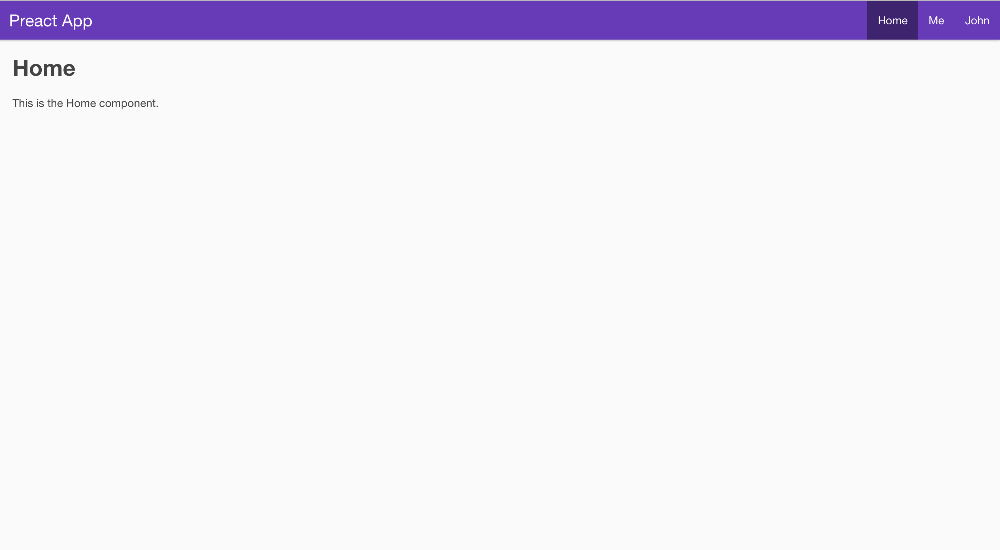
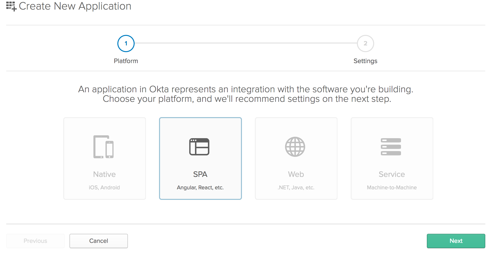
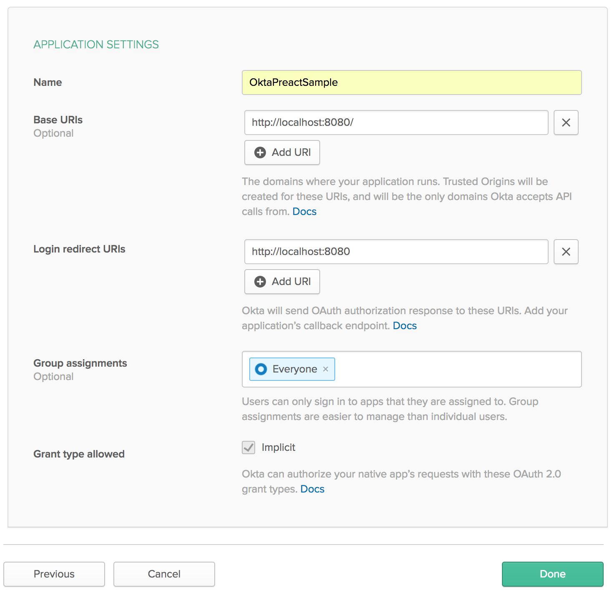
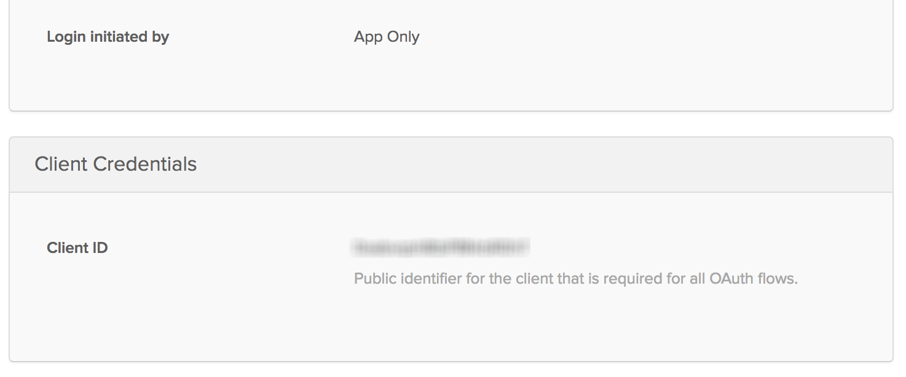

# Build a Preact App With Authentication

Build a Preact App with Authentication in 20 Minutes
React is a fast, and lightweight library, which has led to fast adoption across the SPA (single-page app) ecosystem. Preact is an even lighter-and-faster alternative to React, weighing in at a measly 3kb! For less complex applications, it can be a great choice.

In this tutorial, you'll build a basic Preact application with a couple of pages and user authentication using [Okta's sign in widget](https://developer.okta.com/code/javascript/okta_sign-in_widget). You'll follow the [documentation](https://developer.okta.com/code/react/okta_react_sign-in_widget.html) for React applications and modify where necessary to use Preact!

## Bootstrap Your App With PreactCLI
To get your project started, you'll install the [PreactCLI](https://github.com/developit/preact-cli) using [NPM](https://www.npmjs.com/package/preact-cli).

```bash
npm install -g preact-cli
```

Once you have the CLI installed, run the command to create a base Preact application:

```bash
preact create okta-preact-example
```
This command will chug along for a few minutes scaffolding a basic Preact app and installing all the dependencies. Once it’s done, you should see a bunch of information on the command line informing you of what you can do next.

Change into the application directory.

```
cd okta-preact-example
```

Then start the application, just to make sure everything worked as expected.

```
npm start
```

You should see a quick build run and the screen will clear and show you that the application is running at <http://localhost:8080>. When you open up that URL in your browser, you should see a page like this:

 


 ### Some Things To Note About PreactCLI
Even though the PreactCLI-generated app looks a lot like a React app generated by [create-react-app](https://github.com/facebookincubator/create-react-app), and you can even use some of the React plugins (like [React-Router](https://reacttraining.com/react-router/) in your Preact application, there are some significant differences. 
 
For instance, unlike the ReactCLI, there is no way to `eject` the [Webpack](https://webpack.js.org/) configuration. Instead Preact encourages developers to customize Webpack by creating a file called `preact.config.js`, using Preact's [Webpack Config Helpers](https://github.com/developit/preact-cli/blob/HEAD/docs/webpack-helpers.md) and exporting functions to change the way Webpack behaves.

 ## Create Your Okta Application
Now that you have a basic shell of an application, it’s time to add user authentication.
 If you don't already have one, create a free (forever) account at [Okta](https://developer.okta.com/signup/).

Once you've created an account, go to the admin dashboard and click on "Applications" in the page menu. Then click the green "Add Application" button, then the green "Create New App" button, so that you see a modal window like:

 


 Choose "SPA" from the Platform buttons. [OpenID Connect](http://openid.net/connect/) will already be chosen for you. Click the "Next" button to create your application. 

 This will take you to a screen to "Application Settings" page of the Create Application wizard. Enter "OktaPreactExample" in the Application name field and add <http://localhost:8080> as your Base URI and as a Login redirect URI. When you're done, your form should look like this:

 


_You'll need to create a user (if you don't already have one) and assign your new application to them as well. Or you can log in with the credentials you use to log in to your Okta account (the admin user)._

## Install the Okta Sign In WIdget

The easiest way to get Okta's authentication into your new Preact application will be to use Okta's [Sign-In Widget](https://github.com/okta/okta-signin-widget). You’ll install it with npm using:

```bash
npm install @okta/okta-signin-widget --save
```

At the top of your `/src/style/index.css` add to imports for the css for the sign in widget:

```css
@import 'https://ok1static.oktacdn.com/assets/js/sdk/okta-signin-widget/1.9.0/css/okta-sign-in.min.css';
@import 'https://ok1static.oktacdn.com/assets/js/sdk/okta-signin-widget/1.9.0/css/okta-theme.css';

```

 Since you're creating a _Preact_ application, you'll follow the [instructions for creating a React application](https://developer.okta.com/code/react/okta_react_sign-in_widget.html) and change some of the code to be used with Preact instead.
## Add An Auth High Order Component
The first thing will be to add some [High Order Components](https://facebook.github.io/react/docs/higher-order-components.html) to help with authentication.

Add a file called `auth.js` in the `/src/lib` folder and copy the code from the [React documentation](https://developer.okta.com/code/react/okta_react_sign-in_widget.html#create-an-authentication-utility) into it. Then, change the React import from:

```js
import React from 'react';
```
to
```js
import { h } from 'preact';
```
The `h` module in Preact is what turns [JSX](https://facebook.github.io/react/docs/introducing-jsx.html) into [DOM elements](https://developer.mozilla.org/en-US/docs/Web/API/Document_Object_Model/Introduction). Normally, React would use the `React` library to generate `React.createElement` statements to make DOM elements from JSX. Preact uses the `h` library to make something like `h('div', {class:'something'}, 'Content')` statements to do that.

You’ll also need to install `preact-router` with:

```bash
npm install preact-router --save
```
Then, you’ll need to import `route` from preact-router right below the `h` import with:

```js
Import { route } from ‘preact-router’;
```

Then enter your Okta organization URL and client ID to the `OktaSignInWidget` configuration. Your Organization URL will be the URL you use when you log into your Okta account (e.g. http://dev-12345.oktapreview.com) and you can get your client ID from the application's property page in the administrative dashboard on the "General" tab for your application (obviously, yours won't be blurred out):




Back in the `auth.js` code, remove the `issuer` property from `authParams`. You'll just be authenticating with your Okta org as the Identity Provider (IdP). You could also set up an authorization server, but not today for brevity's sake.

You'll also want to change the `redirectUri` property to <http://localhost:8080> because the Preact uses port `8080` instead of `3000` for normal React apps.

 You'll notice `history` getting passed to the `login` and `logout` methods. Remove the `history` parameter and change the login function to use the Preact Router instead, from:

```js
login(history) {
  // Redirect to the login page
  history.push('/login');
}
```

to:

```js
login() {
  // Redirect to the login page
  route('/login/');
}
```

Then change the `logout` function to use the `window.location` property. (This way we'll reload the page after logout), from:

```js
async logout(history) {
  this.widget.tokenManager.clear();
  await this.widget.signOut();
  history.push('/');
}
```
to:
```js
async logout() {
  this.widget.tokenManager.clear();
  await this.widget.signOut();
  location = '/';
}
```

## Create a Widget Wrapper
Create a file in your `/src/lib` folder called `OktaSignInWidget.js`. Using the [code from the documentation](https://developer.okta.com/code/react/okta_react_sign-in_widget.html#create-a-widget-wrapper), modify it for Preact. First, remove the reference to React-DOM. You'll use a neat little trick to get a handle on the DOM element where you'll render the widget and change the React import from:

```js
import React, { Component } from 'react';
```

to:

```js
import { h, Component } from 'preact';
```
Preact also has the `Component` module that will be used in the code.

Next change the `ComponentDidMount` function from:

```js
componentDidMount() {
  const el = ReactDOM.findDOMNode(this);
  this.widget = this.props.widget;
  this.widget.renderEl({el}, this.props.onSuccess, this.props.onError);
}
```

to:

```js
componentDidMount() {
  this.widget = this.props.widget;
  this.widget.renderEl({ el: this.widgetContainer }, this.props.onSuccess, this.props.onError);
}
```

Then change the `render` method:

```js
render() {
  return <div />;
}
```

to:

```js
render() {
  return <div ref={(div) => { this.widgetContainer = div; }} />
}
```

This allows you to set a reference to the current element into a variable called `widgetContainer` and then use it in the `componentDidMount` as `this.widgetContainer`. Neat, huh? Thanks to [Matt Raible](https://twitter.com/mraible) for showing me that trick!

## Create a Redirect Component
The React-Router has a Redirect component in it, but the Preact router doesn't, so you'll need one. Luckily, it's very easy to create your own. In your `/src/lib` folder create a file called `Redirect.js` and add the following code:

```js
import { Component } from 'preact';

export default class Redirect extends Component {
  componentWillMount() {
    location = this.props.to.pathname;
  }

  render() {
    return null;
  }
}
```

This is just a component that will redirect based on a url passed to it. In this case, the use will be redirected using the `window.location` mechanism, mostly because you'll want to refresh the page. You could also just use `route(this.props.to.pathname)` and let Preact's router redirect the user.

## Create a Login Component
Next, create a `Login` folder in `src/routes`. Then in there create an `index.js` file and a `style.css` file. This just follows along with the way the Preact CLI creates routable components.

In the `index.js` file, create a `Login` component, wrapped in the `withAuth` component. First, by importing the modules needed:

```js
import { h, Component } from 'preact';
import Redirect from '../../lib/Redirect';
import OktaSignInWidget from '../../lib/OktaSignInWidget';
import { withAuth } from '../../lib/auth';
```

Start the component by wrapping in the `withAuth` high order component you created earlier, and set the beginning state. Here, you'll have the `redirectToReferrer` set to false by default.

```js
export default withAuth(class Login extends Component {
  state = {
    redirectToReferrer: false
  };
}
```

In the `componentWillMount` lifecycle function, wire up the `onSuccess` and `onError` functions and create them in your component.

```js
  componentWillMount() {
    this.onSuccess = this.onSuccess.bind(this);
    this.onError = this.onError.bind(this);
  }

  onSuccess(tokens) {
    this.props.auth.handleAuthentication(tokens);
    this.setState({
      redirectToReferrer: true
    });
  }

  onError(err) {
    console.log('error logging in', err);
  }
```

You'll notice your component passes handling of the authentication back to the high order component. This is a prime example of the benefits of high order components and composition in JavaScript.

Finally, create the `render` function that will make the decision about showing the login widget or, if the user is already logged in, redirecting them to the home page. You could also redirect the user to the page they were going to when they were redirected to the login page, but let's skip that for now.

```js
render({location, auth}, {redirectToReferrer}) {
    let from;
    if (location && location.state) {
      from = location.state;
    } else {
      from = { pathname: '/' };
    }

    if (auth.isAuthenticated() || redirectToReferrer) {
      return <Redirect to={from} />;
    }

    return (
      <OktaSignInWidget
        widget={auth.widget}
        onSuccess={this.onSuccess}
        onError={this.onError} />
    );
  }
```

You'll notice here that Preact is a little different in that it gives you handles to `props` and `state` as parameters to the `render` function. This code simply uses destructuring of those parameters to make using `location`, `auth` and `redirectToReferrer` simple without having a ton of `this.props.{whatever}`. 

So your final `/src/routes/login/index.js` file will look like:

```js
import { h, Component } from 'preact';
import Redirect from '../../lib/Redirect';
import OktaSignInWidget from '../../lib/OktaSignInWidget';
import { withAuth } from '../../lib/auth';

export default withAuth(class Login extends Component {
  state = {
    redirectToReferrer: false
  };

  componentWillMount() {
    this.onSuccess = this.onSuccess.bind(this);
    this.onError = this.onError.bind(this);
  }

  onSuccess(tokens) {
    this.props.auth.handleAuthentication(tokens);
    this.setState({
      redirectToReferrer: true
    });
  }

  onError(err) {
    console.log('error logging in', err);
  }

 render({location, auth}, {redirectToReferrer}) {
    let from;
    if (location && location.state) {
      from = location.state;
    } else {
      from = { pathname: '/' };
    }

    if (auth.isAuthenticated() || redirectToReferrer) {
      return <Redirect to={from} />;
    }

    return (
      <OktaSignInWidget
        widget={auth.widget}
        onSuccess={this.onSuccess}
        onError={this.onError} />
    );
  }
})
```

## Update the Profile Page
Now that you have the `Login` component and it is using the Okta-SignIn-Widget, use the `auth` component you created and update the profile page (in `/src/routes/profile/index.js`) to give you some more information about the user. This is what your final `/src/routes/profile/index.js` file should look like:

```js
import { h, Component } from 'preact';
import { route } from 'preact-router';
import { withAuth } from '../../lib/auth';
import style from './style';

export default withAuth(class Profile extends Component {

  constructor(props){
    super(props);
  }

  componentWillMount(){
    if(this.props.auth.isAuthenticated()){
      this.state = {
        user: this.props.auth.getCurrentUser()
      };
    }else{
      return route('/login/');
    }
  }

  render(props, { user }) {
    return (
      user ?
      <div class={style.profile}>
        <h3 class={style.heading}>Profile</h3>
        <ul>
          <li>
            <span class={style.key}>Name:</span>
            <span class={style.value}>{user.claims.name}</span>
          </li>
          <li>
            <span class={style.key}>Email:</span>
            <span class={style.value}>{user.claims.email}</span>
          </li>
        </ul>
      </div> :
      null
    );
  }
})
```

This will output the user's Name and email address that the `auth` component stored in the `tokenManager` when it stored the `idToken`.

## Skip the SecureRoute Section
Since your application will be using Preact's router instead of React-Router (to keep it all Preact), you don't have React-Router's `Route` module. Preact's router has a `route` module, but it does something different, as we saw in the `auth.js` code. Instead you've added the protection at the `Component` level in the `componentWillMount` function of the `Profile` function above. You can use React's router, and for more complex applications, you will probably want to. There's just more that React's router can do, and it's still the most popular routing engine for React apps.
## Update the Header Component
Now you just need to get the routes into your application and get the menu to link to them. Start by changing the `/src/components/header/index.js` file to: 

```js
import { h, Component } from 'preact';
import { Link } from 'preact-router/match';
import { withAuth } from '../../lib/auth';
import style from './style';

export default withAuth(class Header extends Component {
  
  componentWillMount(){
    if(this.props.auth.isAuthenticated()){
      this.setState({
          user: this.props.auth.getCurrentUser()
      });
    }
  }

  render(props, {user}) {
    return (
      <header class={style.header}>
        <h1>Preact App</h1>
        <nav>
          <Link activeClassName={style.active} href="/">Home</Link>
          {user ? <Link activeClassName={style.active} href="/profile">Profile</Link> : null }
          {user 
            ? <Link activeClassName={style.active} onClick={props.auth.logout.bind(null, props.history)} role="button">Logout</Link>
            : <Link activeClassName={style.active} onClick={props.auth.login.bind(null, props.history)} role="button">Login</Link>}
          
        </nav>
      </header>
    );
  }
})
```

This will show the “Login” button if the user is not logged in and the “Logout” button if they are. It will also only show the “Profile” menu item to those users who are logged in.

## Change Your Routing

Finally, change the routes in your `/src/components/app.js` file so that your application knows about your new routes and how to handle them. So your new `app.js` file will look like:

```js
import { h, Component } from 'preact';
import { Router } from 'preact-router';

import Header from './header';
import Home from '../routes/home';
import Profile from '../routes/profile';
import Login from '../routes/Login';
// import Home from 'async!./home';
// import Profile from 'async!./profile';

export default class App extends Component {
  /** Gets fired when the route changes.
   *  @param {Object} event   "change" event from [preact-router](http://git.io/preact-router)
   *  @param {string} event.url The newly routed URL
   */
  handleRoute = e => {
    this.currentUrl = e.url;
  };

  render() {
    return (
      <div id="app">
        <Header />
        <Router onChange={this.handleRoute}>
          <Home path="/" />
          <Profile path="/profile/" />
          <Login path="/login/" />
        </Router>
      </div>
    );
  }
}
```

All that really changed is that you imported the newly created Login component and remove the user property being passed into the Profile component and added a new route for the Login component.

## Run Your New Preact Application!
You should now be able to save your work and run `npm start` in the root folder and see a fully-functioning Preact application with user authentication via Okta!


## Learn More 
You can find out more about Preact from [their website](https://preactjs.com/) and Preact-Router from the [Github repository](https://github.com/developit/preact-router).

You can also get the complete code for this article from the [Okta Developer Github repository](https://github.com/leebrandt/okta-preact-widget-example).

As always, if you have any questions, comments or concerns about the article, the code, Preact or Okta, feel free to reach out to me via [Email](mailto:lee.brandt@okta.com), or hit me up in the comments or via Twitter [@leebrandt](https://twitter.com/leebrandt).